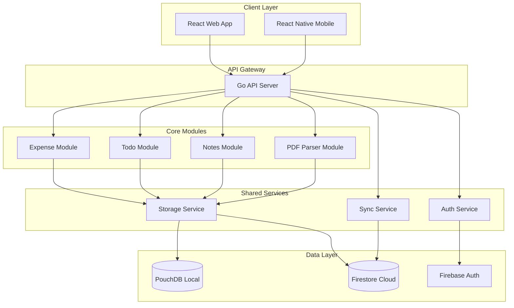

# NestMate Design Document

## Overview

NestMate is architected as a modular, cross-platform productivity application using clean architecture principles. The system consists of three core modules (Expense Tracking, To-Do Management, Notes) with shared infrastructure for authentication, synchronization, and data persistence. The architecture supports both local-first operation and cloud synchronization.

## Architecture

### High-Level Architecture



### Clean Architecture Layers

1. **Presentation Layer**: React/React Native components
2. **Application Layer**: Use cases and application services
3. **Domain Layer**: Business entities and domain logic
4. **Infrastructure Layer**: Database, external services, frameworks

## Components and Interfaces

### Authentication Service

**Purpose**: Handle user authentication using Firebase Auth (primary) or JWT (fallback)

**Interface**:
```go
type AuthService interface {
    Register(email, password string) (*User, error)
    Login(email, password string) (*AuthToken, error)
    Logout(token string) error
    ValidateToken(token string) (*User, error)
    RefreshToken(refreshToken string) (*AuthToken, error)
}
```

**Implementation Notes**:
- Firebase Auth provides free tier up to 10,000 monthly active users
- JWT fallback for self-hosted scenarios
- Token-based session management
- Secure token storage on client side

### Expense Tracking Module

**Domain Entities**:
```go
type Expense struct {
    ID          string
    UserID      string
    Amount      decimal.Decimal
    Description string
    Date        time.Time
    MainCategory string // Chennai House, Bangalore House, Self, Savings
    SubCategory  string // Food, Entertainment, Education, Travel, Misc
    CreatedAt   time.Time
    UpdatedAt   time.Time
}

type Income struct {
    ID        string
    UserID    string
    Amount    decimal.Decimal
    Month     time.Time
    Source    string
    CreatedAt time.Time
}
```

**Service Interface**:
```go
type ExpenseService interface {
    AddExpense(expense *Expense) error
    UpdateExpense(id string, expense *Expense) error
    DeleteExpense(id string) error
    GetExpensesByPeriod(userID string, start, end time.Time) ([]*Expense, error)
    GetMonthlyBreakdown(userID string, month time.Time) (*MonthlyBreakdown, error)
    CalculateSavings(userID string, month time.Time) (decimal.Decimal, error)
    ExportData(userID string, format string) ([]byte, error)
}
```

### PDF Parser Module

**Purpose**: Extract transaction data from bank statement PDFs

**Interface**:
```go
type PDFParserService interface {
    ParseBankStatement(file []byte, bankType string) (*ParsedTransactions, error)
    CategorizeTransactions(transactions []*Transaction) ([]*CategorizedTransaction, error)
    ValidateAndSave(userID string, transactions []*CategorizedTransaction) error
}
```

**Implementation Strategy**:
- Use `pdfcpu` or `unipdf` for PDF text extraction
- Regex-based parsing for different bank formats (ICICI, HDFC, etc.)
- Rule-based categorization engine
- 90%+ accuracy target for common transaction types
- User review interface for corrections

### To-Do Management Module

**Domain Entities**:
```go
type Task struct {
    ID          string
    UserID      string
    Title       string
    Description string
    DueDate     *time.Time
    Priority    Priority // Low, Medium, High
    Status      TaskStatus // Pending, InProgress, Done
    Labels      []string
    Reminders   []Reminder
    IsRecurring bool
    RecurrenceRule *RecurrenceRule
    CreatedAt   time.Time
    UpdatedAt   time.Time
}

type Priority int
const (
    Low Priority = iota
    Medium
    High
)
```

**Service Interface**:
```go
type TodoService interface {
    CreateTask(task *Task) error
    UpdateTask(id string, task *Task) error
    DeleteTask(id string) error
    GetTasksByFilter(userID string, filter *TaskFilter) ([]*Task, error)
    GetTasksForPeriod(userID string, start, end time.Time) ([]*Task, error)
    MarkTaskComplete(id string) error
    SetReminder(taskID string, reminder *Reminder) error
}
```

### Notes Management Module

**Domain Entities**:
```go
type Note struct {
    ID          string
    UserID      string
    Title       string
    Content     string // Markdown format
    Tags        []string
    IsFavorite  bool
    Attachments []Attachment
    CreatedAt   time.Time
    UpdatedAt   time.Time
}

type Attachment struct {
    ID       string
    Type     AttachmentType // Link, Image
    URL      string
    Metadata map[string]interface{}
}
```

**Service Interface**:
```go
type NotesService interface {
    CreateNote(note *Note) error
    UpdateNote(id string, note *Note) error
    DeleteNote(id string) error
    SearchNotes(userID string, query string) ([]*Note, error)
    GetNotesByTags(userID string, tags []string) ([]*Note, error)
    ExportNote(id string, format string) ([]byte, error)
    AddAttachment(noteID string, attachment *Attachment) error
}
```

### Synchronization Service

**Purpose**: Handle offline-first data sync between local PouchDB and cloud Firestore

**Interface**:
```go
type SyncService interface {
    SyncUserData(userID string) error
    QueueLocalChanges(changes []*ChangeRecord) error
    ResolveConflicts(conflicts []*SyncConflict) error
    GetSyncStatus(userID string) (*SyncStatus, error)
}
```

**Sync Strategy**:
- Local-first with eventual consistency
- Change tracking with timestamps
- Conflict resolution using last-write-wins
- Batch sync operations for efficiency

## Data Models

### Database Schema Design

**Local NoSQL Storage Options**:
- **Realm Database**: Mobile-optimized NoSQL, works offline-first
- **WatermelonDB**: React Native optimized, SQLite-backed but NoSQL interface
- **PouchDB**: JavaScript NoSQL database, syncs with CouchDB/Firestore
- **LokiJS**: In-memory NoSQL database with persistence

**Cloud NoSQL Options (Cost-Effective)**:
- **Firebase Firestore**: Free tier with 1GB storage, 50K reads/day, 20K writes/day
- **MongoDB Atlas**: Free tier with 512MB storage, shared cluster
- **AWS DynamoDB**: Pay-per-use, free tier with 25GB storage
- Document-based storage for flexible schema
- Built-in scalability and backup

**Recommended Stack**: PouchDB (local) + Firestore (cloud) for seamless sync

**Local Document Structure (PouchDB)**:
```javascript
// User document
{
  _id: "user_" + userId,
  type: "user",
  email: string,
  createdAt: timestamp,
  updatedAt: timestamp
}

// Expense document
{
  _id: "expense_" + expenseId,
  type: "expense",
  userId: string,
  amount: number,
  description: string,
  date: timestamp,
  mainCategory: string,
  subCategory: string,
  createdAt: timestamp,
  updatedAt: timestamp
}

// Task document
{
  _id: "task_" + taskId,
  type: "task",
  userId: string,
  title: string,
  description: string,
  dueDate: timestamp,
  priority: number,
  status: number,
  labels: array,
  isRecurring: boolean,
  createdAt: timestamp,
  updatedAt: timestamp
}

// Note document
{
  _id: "note_" + noteId,
  type: "note",
  userId: string,
  title: string,
  content: string,
  tags: array,
  isFavorite: boolean,
  createdAt: timestamp,
  updatedAt: timestamp
}
```

**Firestore Document Structure (Cloud)**:
```javascript
// Users collection
users/{userId} = {
  email: string,
  createdAt: timestamp,
  updatedAt: timestamp
}

// Expenses subcollection
users/{userId}/expenses/{expenseId} = {
  amount: number,
  description: string,
  date: timestamp,
  mainCategory: string,
  subCategory: string,
  createdAt: timestamp,
  updatedAt: timestamp
}

// Tasks subcollection
users/{userId}/tasks/{taskId} = {
  title: string,
  description: string,
  dueDate: timestamp,
  priority: number,
  status: number,
  labels: array,
  isRecurring: boolean,
  createdAt: timestamp,
  updatedAt: timestamp
}

// Notes subcollection
users/{userId}/notes/{noteId} = {
  title: string,
  content: string,
  tags: array,
  isFavorite: boolean,
  createdAt: timestamp,
  updatedAt: timestamp
}
```

## Error Handling

### Error Categories

1. **Validation Errors**: Invalid input data
2. **Authentication Errors**: Auth failures, expired tokens
3. **Business Logic Errors**: Domain rule violations
4. **Infrastructure Errors**: Database, network failures
5. **Sync Errors**: Conflict resolution, connectivity issues

### Error Response Format

```go
type APIError struct {
    Code    string `json:"code"`
    Message string `json:"message"`
    Details map[string]interface{} `json:"details,omitempty"`
}
```

### Error Handling Strategy

- Graceful degradation for offline scenarios
- Retry mechanisms for transient failures
- User-friendly error messages
- Comprehensive logging for debugging
- Circuit breaker pattern for external services

## Testing Strategy

### Unit Testing

- **Domain Logic**: Test business rules and calculations
- **Services**: Mock dependencies, test use cases
- **Repositories**: Test data access patterns
- **Utilities**: Test helper functions and parsers

### Integration Testing

- **API Endpoints**: Test request/response cycles
- **Database Operations**: Test CRUD operations
- **PDF Parser**: Test with sample bank statements
- **Sync Service**: Test offline/online scenarios

### End-to-End Testing

- **User Workflows**: Complete user journeys
- **Cross-Platform**: Web and mobile compatibility
- **Data Consistency**: Sync across devices
- **Performance**: Load testing for scalability

### Test Coverage Goals

- Unit Tests: 90%+ coverage
- Integration Tests: Critical paths covered
- E2E Tests: Major user workflows
- Performance Tests: Response time < 200ms for API calls

### Testing Tools

- **Go**: `testify` for assertions, `gomock` for mocking
- **React**: Jest, React Testing Library
- **React Native**: Jest, Detox for E2E
- **API Testing**: Postman/Newman for automated API tests

## Performance Considerations

### Frontend Optimization

- Code splitting for module loading
- Lazy loading for large datasets
- Caching strategies for frequently accessed data
- Optimistic UI updates for better UX

### Backend Optimization

- Database indexing for common queries
- Connection pooling for database efficiency
- Caching layer (Redis) for frequently accessed data
- Pagination for large result sets

### Mobile Optimization

- Efficient data synchronization
- Background sync capabilities
- Offline-first data storage
- Battery-efficient background tasks

## Security Considerations

### Authentication Security

- Secure token storage (Keychain/Keystore)
- Token expiration and refresh mechanisms
- Rate limiting for auth endpoints
- Password strength requirements

### Data Security

- Encryption at rest for sensitive data
- HTTPS/TLS for data in transit
- Input validation and sanitization
- SQL injection prevention
- XSS protection for web interface

### API Security

- JWT token validation
- CORS configuration
- Request rate limiting
- Input validation middleware
- Audit logging for sensitive operations